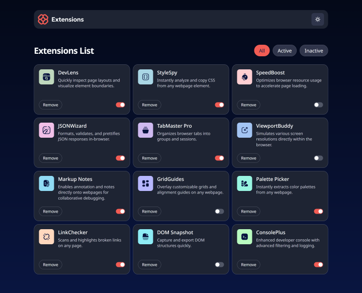
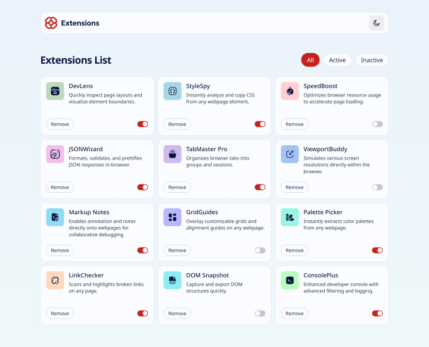
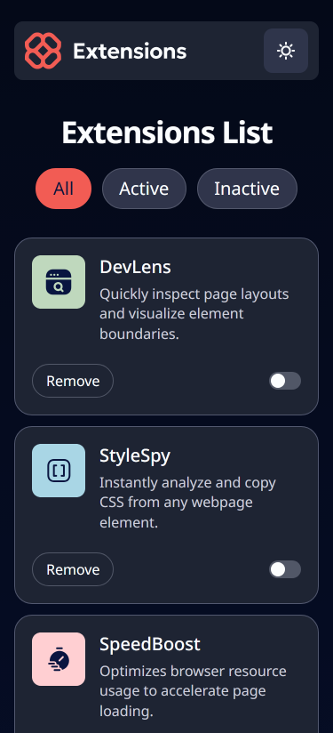
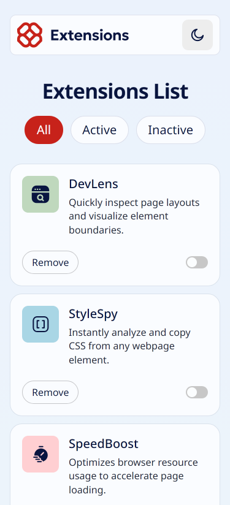

# Recipe Page

A solution to the Frontend Mentor browser extension manager challenge built using React and Sass, and set up using npm and Webpack.

## Table of Contents

- [Why I Built This Project](#why-i-built-this-project)
- [Preview](#preview)
  - [Desktop](#desktop)
  - [Mobile](#mobile)
- [Author](#author)

## Why I Built This Project

I built this project as part of a personal challenge to build more projects with React in order to become more comfortable with the library as it's one that's widely used in the tech industry.

I also wanted to gain more experience with CSS grid as it's a very powerful tool used in many websites to achieve dynamic two-dimensional layouts.

## Preview

### Desktop

Dark

Light

### Mobile

Dark

Light

## Author

- [My website](https://venusy.github.io/portfolio/)
- [Frontend Mentor](https://www.frontendmentor.io/profile/VenusY)
- [GitHub](https://github.com/VenusY)